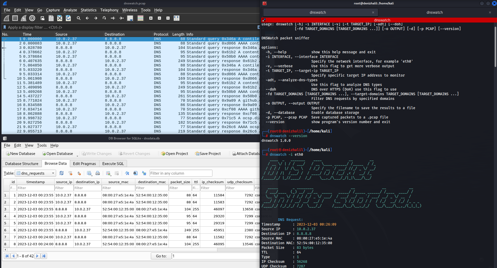

# DNSWatch - DNS Traffic Sniffer and Analyzer
DNSWatch is a powerful packet sniffing tool designed to monitor and analyze DNS (Domain Name System) traffic on a network. This script provides a comprehensive set of features to help users understand and manage DNS activity efficiently. Whether you're a network administrator, cybersecurity professional, or a curious enthusiast, DNSWatch empowers you to gain insights into DNS requests, detect anomalies, and enhance network security.



<h4 align="center">
<br>
   <a href="https://buymeacoffee.com/halildeniz" target="_blank"></a>
</h4>


## Features

- **DNS Packet Sniffing**: The script can sniff DNS packets on the network interface specified by the user.
- **Verbose Output**: It provides detailed output if the user enables the verbose mode
- **Target IP Analysis**: Users can specify a target IP address to analyze DNS responses 
- **DNS Type Analysis**: Users can analyze different types of DNS requests.
- **DNS over HTTPS (DoH)**: Users can enable DNS resolution using DNS over HTTPS.
- **Target Domain Monitoring**: Users can specify a list of target domains to monitor.
- **Port Filtering**: It supports filtering by source or destination port.
- **IP Filtering**: Users can filter packets by source or destination IP address.
- **DNS Type Filtering**: allows users to filter packets by DNS type.
- **PCAP File Saving**: Users can save captured packets to a PCAP file.
- **DNS Firewall Mode**: The DNS firewall mode for detecting DNS spoofing attempts.
- **Threshold Setting**: Users can set the threshold for the number of DNS queries .
- **Window Size Configuration**: Allows users to configure the window size (in seconds) for monitoring.
- **Version Information**: Users can check the version of the script.


## Requirements

- Python 3.7+
- scapy 2.4.5 or higher
- colorama 0.4.4 or higher

## Installation

1. Clone this repository:

```bash
git clone https://github.com/HalilDeniz/DNSWatch.git
```

2. Install the required dependencies:

```bash
pip install -r requirements.txt
```

## Usage

```
$ python3 dnswatch.py [-h] [-i INTERFACE] [-v] [-t TARGET_IP] [-d] [--doh] [-D TARGET_DOMAINS [TARGET_DOMAINS ...]] [-p FILTER_PORT] [-s FILTER_SRC_IP] [-r FILTER_DST_IP] [--dns-type DNS_TYPE] [--pcap-file PCAP_FILE] [--firewall] [--threshold THRESHOLD] [--window-size WINDOW_SIZE] [--version]```
```

1. `-i, --interface`: Used to specify the network interface to listen on. For example: `-i eth0`
2. `-v, --verbose`: Use this flag to get detailed output.
3. `-t, --target-ip`: Used to specify a specific IP address to monitor. For example: `-t 8.8.8.8`
4. `-d, --analyze-dns-type`: Use this flag to analyze DNS types.
5. `--doh`: Use DNS over HTTPS (DoH) for DNS resolution.
6. `-D, --target-domains`: Used to specify the target domains to monitor. Accepts a space-separated list of multiple domain names. For example: `-D example.com example.org`
7. `-p, --filter-port`: Use this flag followed by a port number to filter by a specific port. For example: `-p 53`
8. `-s, --filter-src-ip`: Use this flag to filter by a specific source IP address. For example: `-s 192.168.1.1`
9. `-r, --filter-dst-ip`: Use this flag to filter by a specific destination IP address. For example: `-r 8.8.4.4`
10. `--dns-type`: Use this flag followed by a DNS type to filter by a specific DNS type. For example: `--dns-type 1` (for type A)
11. `--pcap-file`: Use this flag to save captured packets to a PCAP file. For example: `--pcap-file captured_packets.pcap`
12. `--firewall`: Enable DNS firewall mode.
13. `--threshold`: Use this flag to set the threshold for the number of DNS queries. For example: `--threshold 50`
14. `--window-size`: Use this flag to set the window size (in seconds). For example: `--window-size 60`
15. `--version`: Use this flag to display the program's version number.


Press `Ctrl+C` to stop the sniffing process.

## Usage Examples

Here are some usage examples of DNSWatch: [You can explore it here](https://denizhalil.com/2023/09/05/dnswatch-dns-traffic-analyzer/):


## License

DNSWatch is licensed under the MIT License. See the [LICENSE](LICENSE) file for details.

## Disclaimer

This tool is intended for educational and testing purposes only. It should not be used for any malicious activities.

## Contact

- Email    : halildeniz313@gmail.com
- Linkedin : https://www.linkedin.com/in/halil-ibrahim-deniz/
- TryHackMe: https://tryhackme.com/p/halilovic
- Instagram: https://www.instagram.com/deniz.halil333/
- YouTube  : https://www.youtube.com/c/HalilDeniz
- Mysite   : https://denizhalil.com/

## 💰 You can help me by Donating
Thank you for considering supporting me! Your support enables me to dedicate more time and effort to creating useful tools like DNSWatch and developing new projects. By contributing, you're not only helping me improve existing tools but also inspiring new ideas and innovations. Your support plays a vital role in the growth of this project and future endeavors. Together, let's continue building and learning. Thank you!"
[](https://buymeacoffee.com/halildeniz) 
[](https://patreon.com/denizhalil) 

  
