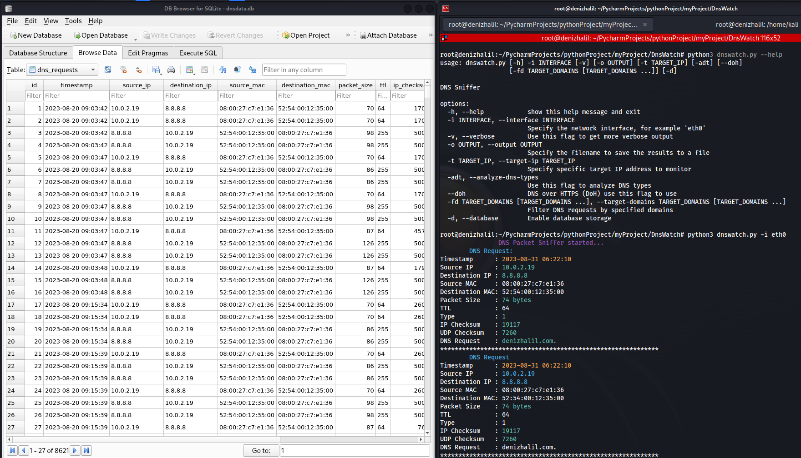

# DNSWatch - DNS Traffic Sniffer and Analyzer
DNSWatch is a Python-based tool that allows you to sniff and analyze DNS (Domain Name System) traffic on your network. It listens to DNS requests and responses and provides insights into the DNS activity.


## Features

- Sniff and analyze DNS requests and responses.
- Display DNS requests with their corresponding source and destination IP addresses.
- Optional verbose mode for detailed packet inspection.
- Save the results to a specified output file.
- Filter DNS traffic by specifying a target IP address.
- Save DNS requests in a database for further analysis(optional)
- Analyze DNS types (optional).
- Support for DNS over HTTPS (DoH) (optional).

## Requirements

- Python 3.7+
- scapy 2.4.5 or higher
- colorama 0.4.4 or higher

## Installation

1. Clone this repository:

```bash
git clone https://github.com/HalilDeniz/DNSWatch.git
```

2. Install the required dependencies:

```bash
pip install -r requirements.txt
```

## Usage

```
python dnswatch.py -i <interface> [-v] [-o <output_file>] [-k <target_ip>] [--analyze-dns-types] [--doh]
```

- `-i`, `--interface`: Specify the network interface (e.g., eth0).
- `-v`, `--verbose`: Use this flag for more verbose output.
- `-o`, `--output`: Specify the filename to save results.
- `-t`, `--target-ip`: Specify a specific target IP address to monitor.
- `-adt`, `--analyze-dns-types`: Analyze DNS types.
- `--doh`: Use DNS over HTTPS (DoH) for resolving DNS requests.
- `-fd`, `--target-domains`: Filter DNS requests by specified domains.
- `-d`, `--database`: Enable database storage for DNS requests.

Press `Ctrl+C` to stop the sniffing process.

## Examples

- Sniff DNS traffic on interface "eth0":
```bash
python dnswatch.py -i eth0
```

- Sniff DNS traffic on interface "eth0" and save the results to a file:
```bash
python dnswatch.py -i eth0 -o dns_results.txt
```

- Sniff DNS traffic on interface "eth0" and filter requests/responses involving a specific target IP:
```bash
python dnswatch.py -i eth0 -t 192.168.1.100
```

- Sniff DNS traffic on interface "eth0" and enable DNS type analysis:
```bash
python dnswatch.py -i eth0 --analyze-dns-types
```

- Sniff DNS traffic on interface "eth0" using DNS over HTTPS (DoH):

```bash
python dnswatch.py -i eth0 --doh
```

- Sniff DNS traffic on interface "wlan0" and Enable database storage
```bash
python3 dnswatch.py -i wlan0 --database
```
## License

DNSWatch is licensed under the MIT License. See the [LICENSE](LICENSE) file for details.

## Disclaimer

This tool is intended for educational and testing purposes only. It should not be used for any malicious activities.

## Contact

- Email    : halildeniz313@gmail.com
- Linkedin : https://www.linkedin.com/in/halil-ibrahim-deniz/
- TryHackMe: https://tryhackme.com/p/halilovic
- Instagram: https://www.instagram.com/deniz.halil333/
- YouTube  : https://www.youtube.com/c/HalilDeniz
- Mysite   : https://denizhalil.com/

## 💰 You can help me by Donating
Thank you for considering supporting me! Your support enables me to dedicate more time and effort to creating useful tools like DNSWatch and developing new projects. By contributing, you're not only helping me improve existing tools but also inspiring new ideas and innovations. Your support plays a vital role in the growth of this project and future endeavors. Together, let's continue building and learning. Thank you!"<br>
[](https://buymeacoffee.com/halildeniz) 
[](https://patreon.com/denizhalil) 

  
